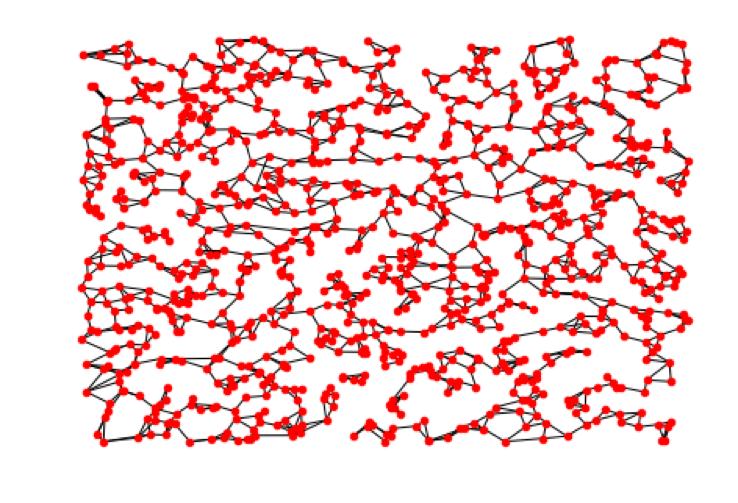
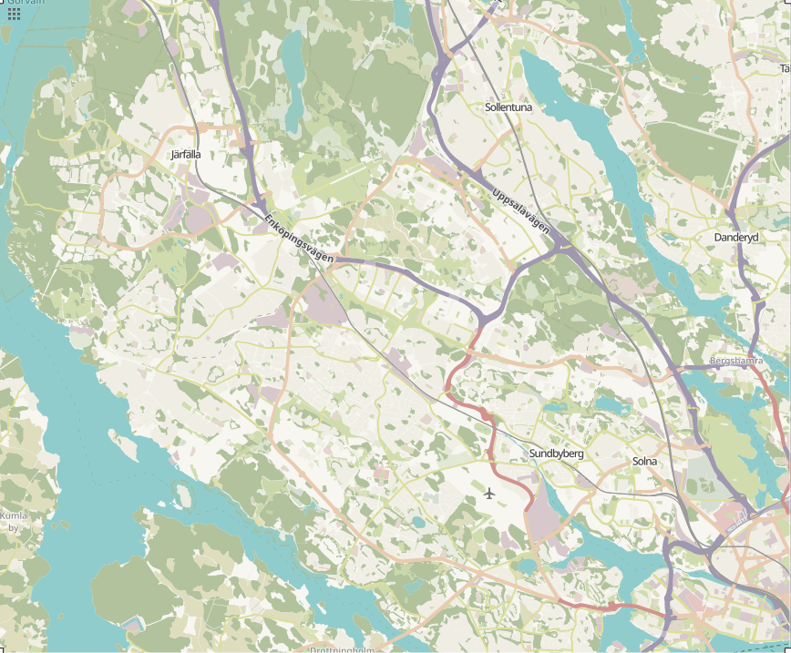

# A Deep Learning Approach for Route Planning in Road Networks
## Background
Traditionally, route planning in road networks relies heavily on shortest path algorithms such as Dijkstra's and A* search.
Dijkstra's algorithm guarantees to find the optimal paths if exist. However, its time complexity, $O(E + VlogV)$ where $E$ and $V$ are the number of edges and nodes respectively, makes it inefficient in large graphs. A* search, as a variation of Dijkstra's, uses heuristics to accelerate, resulting in complexity of $\Theta (E)$. The acceleration comes at the prices that:  
* the algorithm is not guaranteed to converge, meaning it may not be able to find paths;  
* the paths generated are not necessarily the optimal ones.  

What makes route planning difficult if the dynamic nature of road networks. The road conditions are constantly changing. However, Dijkstra's and A* search algorithm treat a graph as static in order to find the optimal paths. Stated differently, these two algorithms are sensitive to the changes in the graph. To overcome this, the shortest path algorithm can be called everytime the traveler reaches a crossroad, which again has large computational cost.

An algorithm that takes into account the dynamics without sacrificing performance has large practical use. It can be used for real time route planning by yielding realistic paths. Deep Learning has been successful in many tasks mainly due to the following facts:  
* it automatically extracts high-level features from the data;  
* it can approximate arbitrary functions;  
* it is tractable for a model to be trained on large dataset.

## Method
### Dataset
#### Random Graphs
The idea is first tested on random graphs. Graphs are generated based on the following assumption:  
* Nodes are randomly given (x, y) Euclidean coordinates;  
* Nodes are more likely to be connected when they are geographically
closer;  
* Each node has maximum 4 and minimum 2 out neighbors;  
* Weights of edges are the multiplication of nodes Euclidean distance and a random relaxation factor.  
An example is shown in the following plot:

#### OpenStreetMap
In the end, the deep learning model is expected to perform route planning task in real road network. For that, OpenStreetMap is used, as shown in the following image:

The graph is abstracted from this area is shown as the following:

### Algorithm
The model is trained to make local optimal choices by taking all features of neighboring nodes and edges into consideration.

## Experiments

