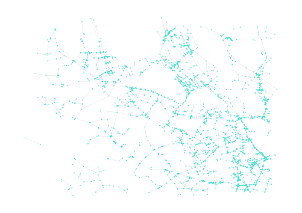
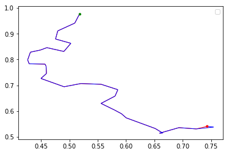
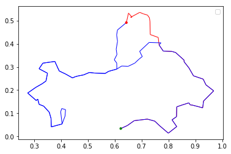
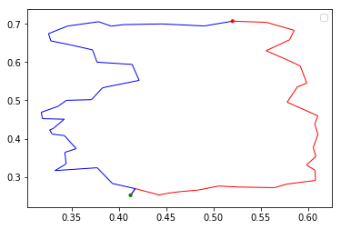
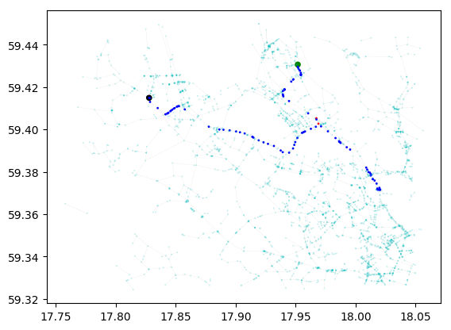
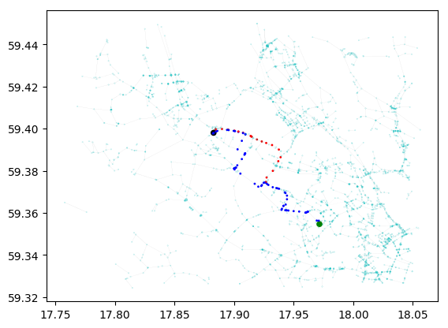

# A Deep Learning Approach for Route Planning in Road Networks
## Background
Traditionally, route planning in road networks relies heavily on shortest path algorithms such as Dijkstra's and A* search.
Dijkstra's algorithm guarantees to find the optimal paths if exist. However, its time complexity, $O(E + VlogV)$ where $E$ and $V$ are the number of edges and nodes respectively, makes it inefficient in large graphs. A* search, as a variation of Dijkstra's, uses heuristics to accelerate, resulting in complexity of $\Theta (E)$. The acceleration comes at the prices that:  
* the algorithm is not guaranteed to converge, meaning it may not be able to find paths;  
* the paths generated are not necessarily the optimal ones.  

What makes route planning difficult if the dynamic nature of road networks. The road conditions are constantly changing. However, Dijkstra's and A* search algorithm treat a graph as static in order to find the optimal paths. Stated differently, these two algorithms are sensitive to the changes in the graph. To overcome this, the shortest path algorithm can be called everytime the traveler reaches a crossroad, which again has large computational cost.

An algorithm that takes into account the dynamics without sacrificing performance has large practical use. It can be used for real time route planning by yielding realistic paths. Deep Learning has been successful in many tasks mainly due to the following facts:  
* it automatically extracts high-level features from the data;  
* it can approximate arbitrary functions;  
* it is tractable for a model to be trained on large dataset.

## Method
### Dataset
#### Random Graphs
The idea is first tested on random graphs. Graphs are generated based on the following assumption:  
* Nodes are randomly given (x, y) Euclidean coordinates;  
* Nodes are more likely to be connected when they are geographically
closer;  
* Each node has maximum 4 and minimum 2 out neighbors;  
* Weights of edges are the multiplication of nodes Euclidean distance and a random relaxation factor.  
An example is shown in the following plot:

#### OpenStreetMap
In the end, the deep learning model is expected to perform route planning task in real road network. For that, OpenStreetMap is used, as shown in the following image:

The graph is abstracted from this area is shown as the following:
  
### Algorithm
The model is trained to make local optimal choices by taking all features of neighboring nodes and edges into consideration. More details can be seen from the source code.

## Experiments
Boring numbers will not be presented here. It is more interesting to see how a deep model actually traverses in a graph.
### Random Graph Traversal

  

  
The trained model is applied on the 1000-node shown above. The paths generated by the neural agent is compared with the corresponding optimal paths.
Those four plots are selected carefully and therefore are representative. The red dots are origins and green ones are destinations.
Apparently, those paths might not be optimal. One interesting observation is that the agent is able to correct its mistakes when gets stuck at some point. Take the upper right figure for example, the agent made the first wrong move at the very beginning and therefore had a hard time making its way to the destination. However, it somehow crawled its way back, put itself on the right track, and made it to the end.
There are cases where the model takes an entirely different path, as can be seen from the figure at bottom right. There are cases where the model takes fairly good approximation of optimal paths, shown in the upper left and bottom left figure.
### Road Network Traversal
  
  
Previous evaluation has shown that Deep Learning model can indeed traverse a graph. It is necessary that the insights and knowledge gained by training Neural Networks on random graphs can be well translated to road network. The target road network is shown in the figure above.
The path generated by the neural agent is compared with actual shortest path, shown in the two plots. The black and green dots represent the origin and destination respectively. As can be seen, the model has applied similar strategies learned from the training on random graphs. Even though the model made a wrong turn at some point and it struggle a bit by following the wrong direction, the model still managed to crawl its way back, put itself on the right track, and made its way to the destination.
## Summary
This project is focused on heuristics-guided graph traversal with Neural Networks. The hypothesis is that Neural Network can be trained to perform real time route planning. It achieves this by making local optimal choices. We are able to give a positive answer to this hypothesis.
